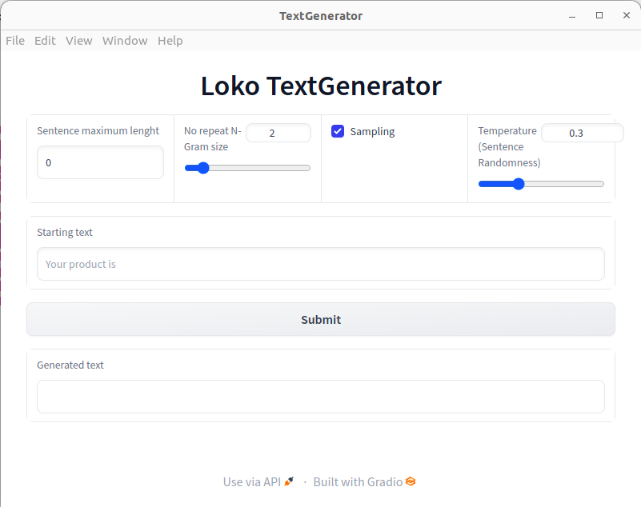

# Text Generation Extensions

This extensions offers the possibility to use a block, TextGenerator, that as the name implies, will generate some text. 

You can decide a text to use as starting point, and you can also specify other parameters too:

- **Sentence Maximum Length:** maximum lenght of the generated sentence;
- **Sampling:** whether to sample words, randomly picking the next ones
  according to their conditional probability distribution, or to pick them in a deterministic way;
- **Temperature:** value between 0 and 1, that will sharp the probability distribution, increasing the  likelihood of high probability words and decreasing the likelihood of low probability words. Essentially, applying this parameter the generation of word will be less random: with temperature close to 0, the most probable word will be selected, and the randomness will be dropped;
- **No Repeat N-Gram size:** choose the size of the N-Grams; all N-Grams of that size can only occur once.

You can decide to use the block or to use the GUI, shown below:
